# 业务流程说明文档

## 1. 概述

系统围绕 **积分体系** 为核心，串联学习宣传、随手拍上报、活动签到、助老服务、社情民意、商户积分支付等业务场景。用户通过参与各类活动获取积分，积分可在合作商户消费。

系统涉及三类角色：

| 角色 | 入口 | 认证方式 | 核心操作 |
|------|------|----------|----------|
| 居民/小哥 | 微信小程序（用户端） | 微信登录 | 学习、上报、报名活动、助老服务、商户消费 |
| 商户 | 微信小程序（商户端） | 微信登录 | 查看流水、展示收款码、查看结算 |
| 后台管理员 | 独立管理前端 + Django Admin | 用户名密码 | 审核、内容管理、积分管理、商户管理 |

## 2. 用户注册与认证流程

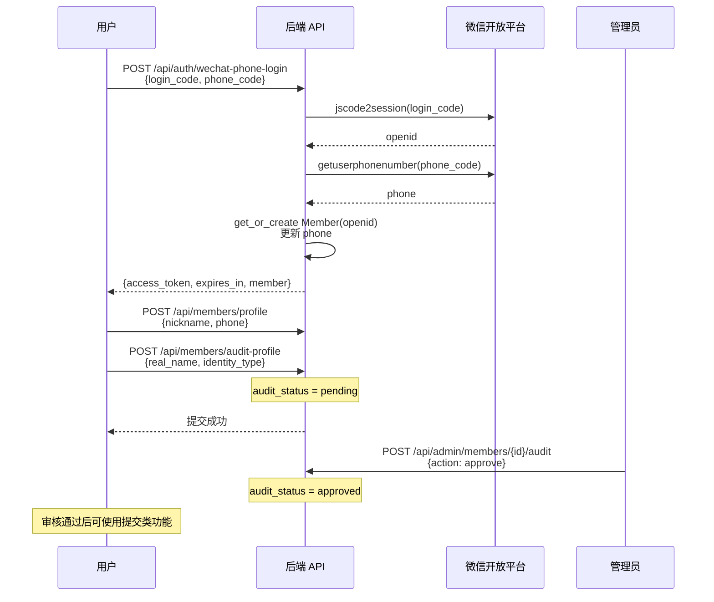
```mermaid
sequenceDiagram
    participant U as 用户
    participant API as 后端 API
    participant WX as 微信开放平台

    U->>API: POST /api/auth/wechat-phone-login<br/>{login_code, phone_code}
    API->>WX: jscode2session(login_code)
    WX-->>API: openid
    API->>WX: getuserphonenumber(phone_code)
    WX-->>API: phone
    API->>API: get_or_create Member(openid)<br/>更新 phone
    API-->>U: {access_token, expires_in, member}
    U->>API: POST /api/members/profile<br/>{nickname, phone}
    U->>API: POST /api/members/audit-profile<br/>{real_name, identity_type}
    Note over API: audit_status = pending
    API-->>U: 提交成功
    管理员->>API: POST /api/admin/members/{id}/audit<br/>{action: approve}
    Note over API: audit_status = approved
    Note over U: 审核通过后可使用提交类功能
```

### 说明

- 微信登录通过 `code` 换取 `openid`，手机号通过 `phone_code` 换取手机号，均为微信小程序标准流程。
- 登录成功后签发 JWT Token（HS256），有效期 7200 秒，客户端通过 `Authorization: Bearer <token>` 携带。
- 用户需提交实名资料（真实姓名 + 身份类型）等待审核。审核通过后（`audit_status = approved`）方可使用上报、反馈等提交类接口（由 `require_approved_member` 守卫）。
- 登录类接口受 P0 限流保护（5 次/分钟/IP）。

## 3. 积分体系流程

### 3.1 积分增加

所有积分增加统一通过 `points/services.py` 的 `add_points` 函数完成：

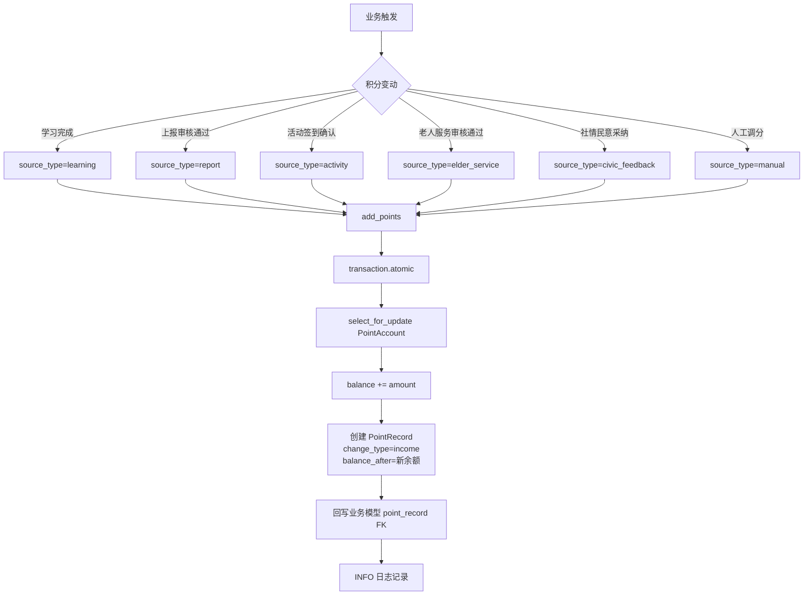
```mermaid
flowchart TD
    A[业务触发] --> B{积分变动}
    B -->|学习完成| C1[source_type=learning]
    B -->|上报审核通过| C2[source_type=report]
    B -->|活动签到确认| C3[source_type=activity]
    B -->|老人服务审核通过| C4[source_type=elder_service]
    B -->|社情民意采纳| C5[source_type=civic_feedback]
    B -->|人工调分| C6[source_type=manual]

    C1 --> D[add_points]
    C2 --> D
    C3 --> D
    C4 --> D
    C5 --> D
    C6 --> D

    D --> E[transaction.atomic]
    E --> F[select_for_update PointAccount]
    F --> G[balance += amount]
    G --> H[创建 PointRecord<br/>change_type=income<br/>balance_after=新余额]
    H --> I[回写业务模型 point_record FK]
    I --> J[INFO 日志记录]
```

### 3.2 积分扣减

商户积分支付扣减通过 `deduct_points` 函数完成：

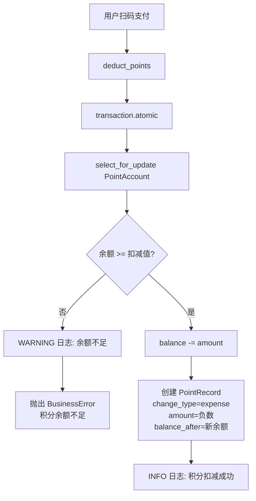
```mermaid
flowchart TD
    A[用户扫码支付] --> B[deduct_points]
    B --> C[transaction.atomic]
    C --> D[select_for_update PointAccount]
    D --> E{余额 >= 扣减值?}
    E -->|否| F[WARNING 日志: 余额不足]
    F --> G[抛出 BusinessError<br/>积分余额不足]
    E -->|是| H[balance -= amount]
    H --> I[创建 PointRecord<br/>change_type=expense<br/>amount=负数<br/>balance_after=新余额]
    I --> J[INFO 日志: 积分扣减成功]
```

### 3.3 幂等控制

商户支付场景支持 `request_no` 幂等：

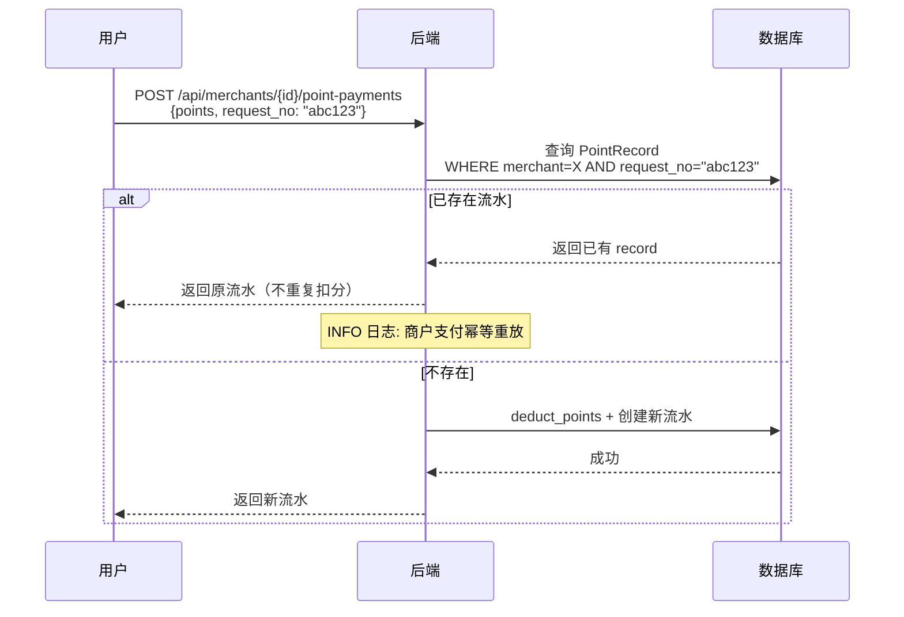
```mermaid
sequenceDiagram
    participant U as 用户
    participant API as 后端
    participant DB as 数据库

    U->>API: POST /api/merchants/{id}/point-payments<br/>{points, request_no: "abc123"}
    API->>DB: 查询 PointRecord<br/>WHERE merchant=X AND request_no="abc123"
    alt 已存在流水
        DB-->>API: 返回已有 record
        API-->>U: 返回原流水（不重复扣分）
        Note over API: INFO 日志: 商户支付幂等重放
    else 不存在
        API->>DB: deduct_points + 创建新流水
        DB-->>API: 成功
        API-->>U: 返回新流水
    end
```

数据库层面通过 `UniqueConstraint(merchant, request_no)` 保障，不传 `request_no` 时每次均扣分（固定码可重复使用）。

## 4. 学习宣传流程

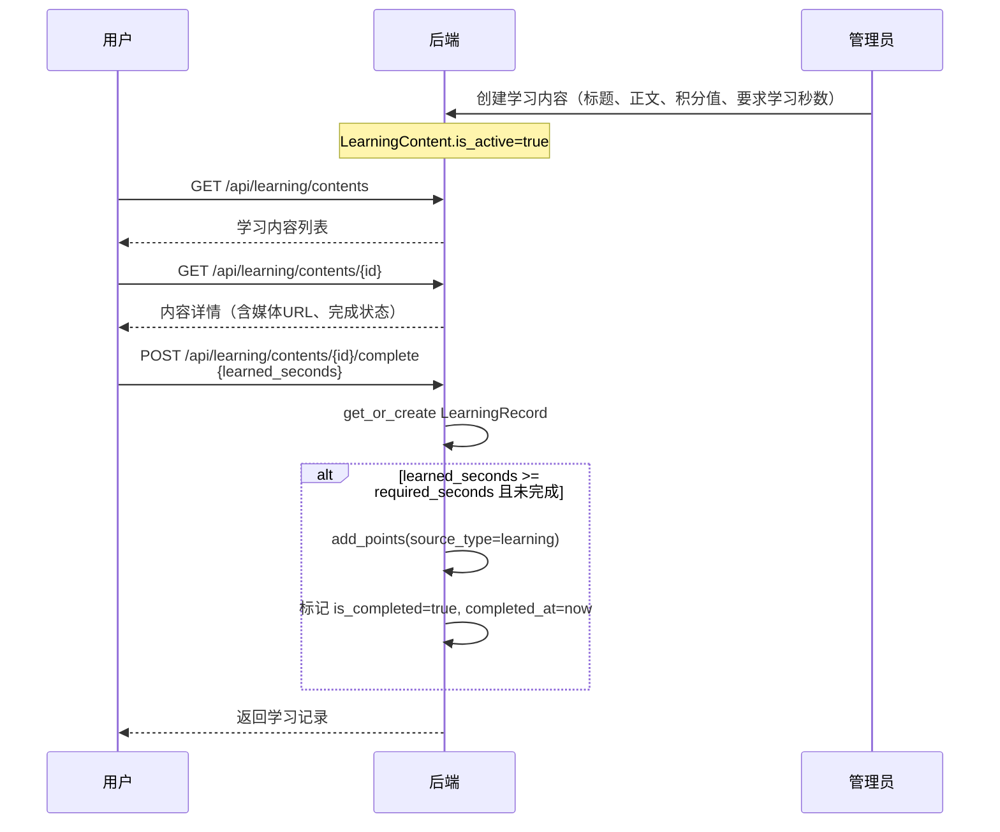
```mermaid
sequenceDiagram
    participant U as 用户
    participant API as 后端
    participant Admin as 管理员

    Admin->>API: 创建学习内容（标题、正文、积分值、要求学习秒数）
    Note over API: LearningContent.is_active=true

    U->>API: GET /api/learning/contents
    API-->>U: 学习内容列表

    U->>API: GET /api/learning/contents/{id}
    API-->>U: 内容详情（含媒体URL、完成状态）

    U->>API: POST /api/learning/contents/{id}/complete<br/>{learned_seconds}
    API->>API: get_or_create LearningRecord
    alt learned_seconds >= required_seconds 且未完成
        API->>API: add_points(source_type=learning)
        API->>API: 标记 is_completed=true, completed_at=now
    end
    API-->>U: 返回学习记录
```

### 说明

- 学习内容支持三种类型：图文文章、图片内容、视频内容。
- 后台通过 TinyMCE 富文本编辑器编辑正文，支持图片和视频上传。
- 用户学习时长达到要求秒数后完成学习，自动发放积分（仅一次）。
- `LearningRecord` 有 `unique_together(member, content)` 约束，同一用户对同一内容仅一条记录。

## 5. 随手拍上报流程

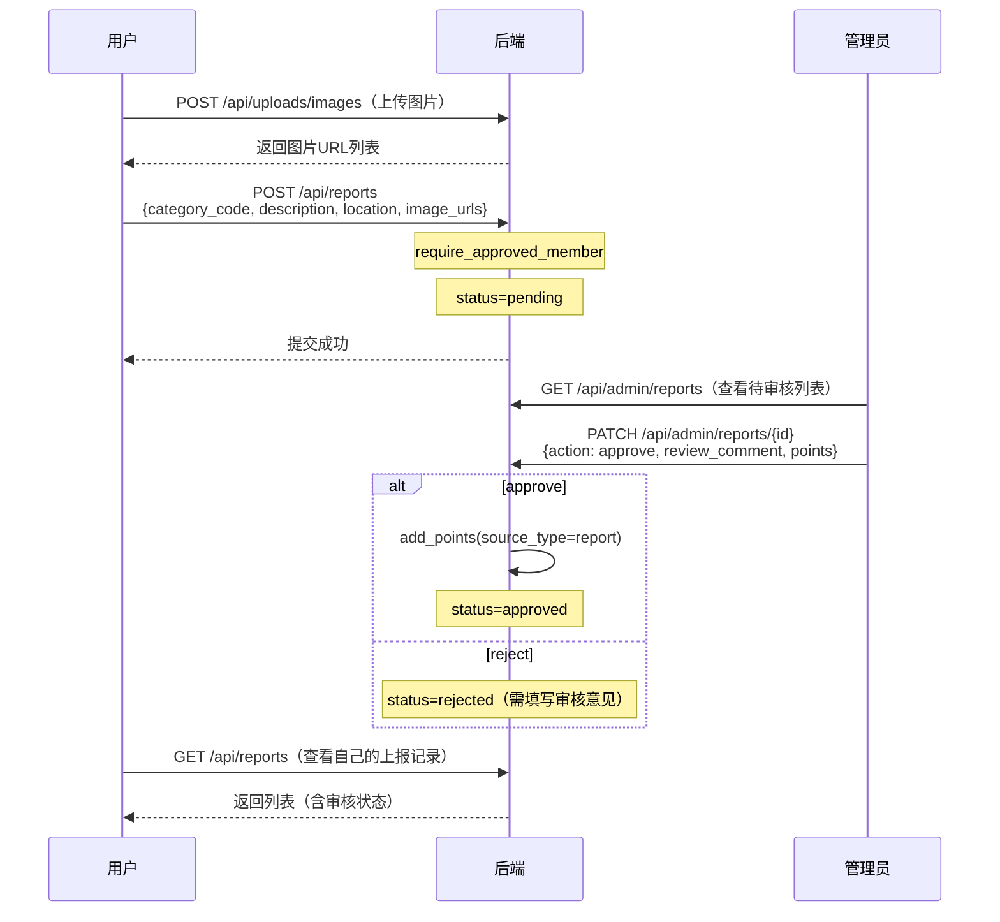
```mermaid
sequenceDiagram
    participant U as 用户
    participant API as 后端
    participant Admin as 管理员

    U->>API: POST /api/uploads/images（上传图片）
    API-->>U: 返回图片URL列表

    U->>API: POST /api/reports<br/>{category_code, description, location, image_urls}
    Note over API: require_approved_member
    Note over API: status=pending
    API-->>U: 提交成功

    Admin->>API: GET /api/admin/reports（查看待审核列表）
    Admin->>API: PATCH /api/admin/reports/{id}<br/>{action: approve, review_comment, points}
    alt approve
        API->>API: add_points(source_type=report)
        Note over API: status=approved
    else reject
        Note over API: status=rejected（需填写审核意见）
    end

    U->>API: GET /api/reports（查看自己的上报记录）
    API-->>U: 返回列表（含审核状态）
```

### 说明

- 上报分类：路灯损坏、井盖问题、管道漏水、道路破损、树木倒伏、其他。
- 提交时支持 1-10 张图片（通过通用上传接口先上传获取 URL）。
- 管理员审核通过时设定积分值并自动发放；驳回时必须填写审核意见。
- 管理员可通过 Django Admin 或后台管理 API 两种方式审核，均调用同一个 `review_report` 服务函数。

## 6. 活动管理流程

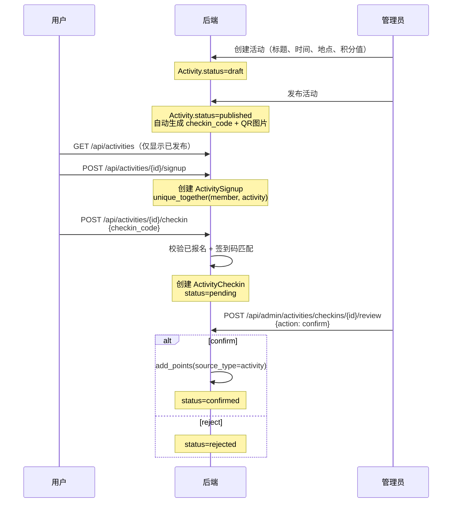
```mermaid
sequenceDiagram
    participant U as 用户
    participant API as 后端
    participant Admin as 管理员

    Admin->>API: 创建活动（标题、时间、地点、积分值）
    Note over API: Activity.status=draft
    Admin->>API: 发布活动
    Note over API: Activity.status=published<br/>自动生成 checkin_code + QR图片

    U->>API: GET /api/activities（仅显示已发布）
    U->>API: POST /api/activities/{id}/signup
    Note over API: 创建 ActivitySignup<br/>unique_together(member, activity)

    U->>API: POST /api/activities/{id}/checkin<br/>{checkin_code}
    API->>API: 校验已报名 + 签到码匹配
    Note over API: 创建 ActivityCheckin<br/>status=pending

    Admin->>API: POST /api/admin/activities/checkins/{id}/review<br/>{action: confirm}
    alt confirm
        API->>API: add_points(source_type=activity)
        Note over API: status=confirmed
    else reject
        Note over API: status=rejected
    end
```

### 说明

- 活动状态：草稿 -> 已发布 -> 已关闭。
- 活动创建时自动生成 UUID 签到码和二维码图片，管理员可下载打印。
- 用户需先报名才能签到，签到需输入正确的 `checkin_code`。
- 签到需管理员确认后才发放积分，驳回时填写审核意见。
- 用户可在签到前取消报名，已签到的不可取消。

## 7. 助老服务流程

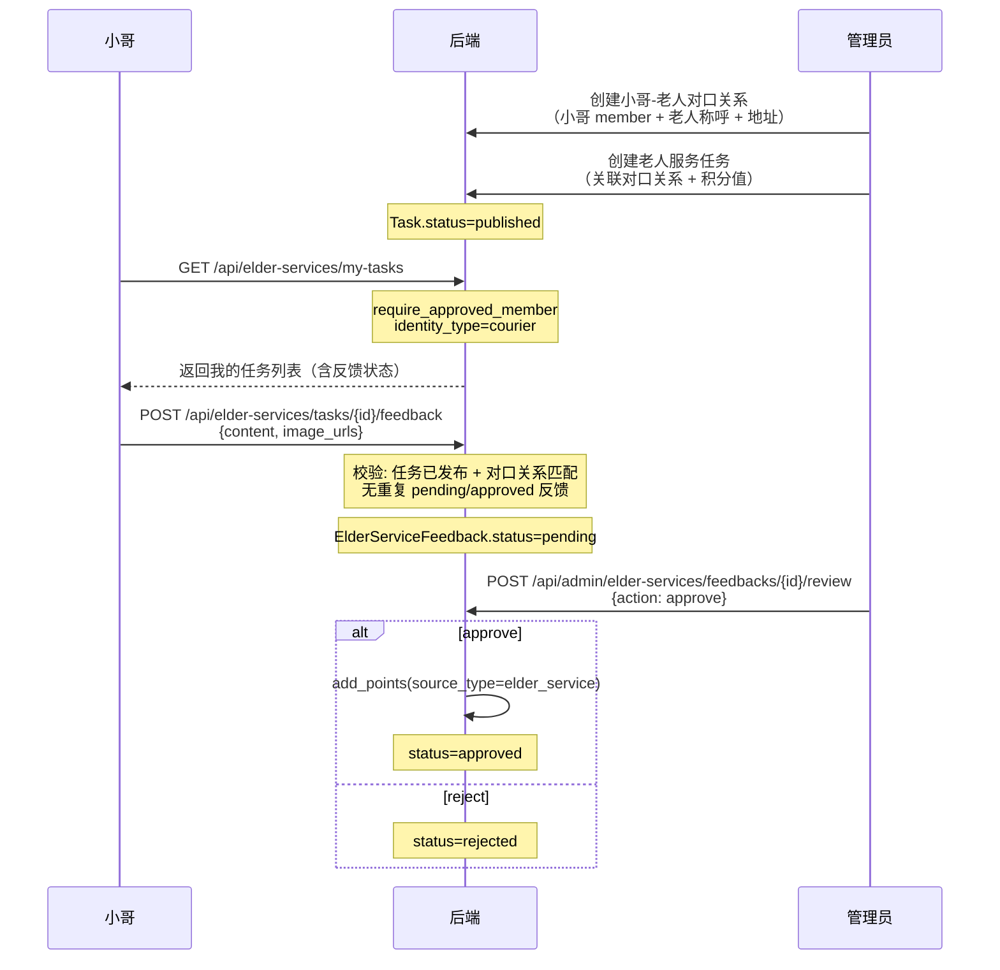
```mermaid
sequenceDiagram
    participant C as 小哥
    participant API as 后端
    participant Admin as 管理员

    Admin->>API: 创建小哥-老人对口关系<br/>（小哥 member + 老人称呼 + 地址）
    Admin->>API: 创建老人服务任务<br/>（关联对口关系 + 积分值）
    Note over API: Task.status=published

    C->>API: GET /api/elder-services/my-tasks
    Note over API: require_approved_member<br/>identity_type=courier
    API-->>C: 返回我的任务列表（含反馈状态）

    C->>API: POST /api/elder-services/tasks/{id}/feedback<br/>{content, image_urls}
    Note over API: 校验: 任务已发布 + 对口关系匹配<br/>无重复 pending/approved 反馈
    Note over API: ElderServiceFeedback.status=pending

    Admin->>API: POST /api/admin/elder-services/feedbacks/{id}/review<br/>{action: approve}
    alt approve
        API->>API: add_points(source_type=elder_service)
        Note over API: status=approved
    else reject
        Note over API: status=rejected
    end
```

### 说明

- 助老服务面向身份类型为「小哥」的审核通过用户。
- 管理员先建立小哥与老人的对口关系，再发布服务任务。
- 小哥提交服务反馈（含文字和图片），管理员审核通过后发放积分。
- 同一任务同一小哥在已有 pending 或 approved 反馈时不可重复提交。

## 8. 社情民意流程

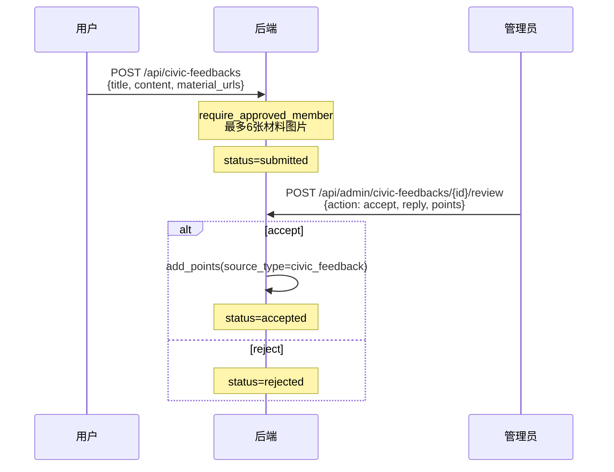
```mermaid
sequenceDiagram
    participant U as 用户
    participant API as 后端
    participant Admin as 管理员

    U->>API: POST /api/civic-feedbacks<br/>{title, content, material_urls}
    Note over API: require_approved_member<br/>最多6张材料图片
    Note over API: status=submitted

    Admin->>API: POST /api/admin/civic-feedbacks/{id}/review<br/>{action: accept, reply, points}
    alt accept
        API->>API: add_points(source_type=civic_feedback)
        Note over API: status=accepted
    else reject
        Note over API: status=rejected
    end
```

### 说明

- 社情民意允许用户提交标题、内容和最多 6 张材料图片。
- 管理员采纳时填写回复和积分值，自动发放积分；驳回时仅填写回复。

## 9. 问题反馈流程

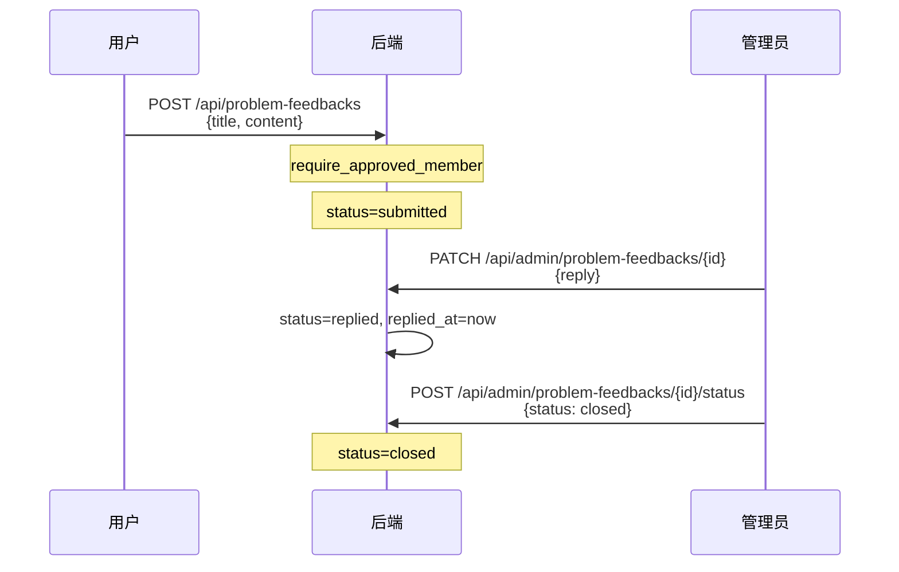
```mermaid
sequenceDiagram
    participant U as 用户
    participant API as 后端
    participant Admin as 管理员

    U->>API: POST /api/problem-feedbacks<br/>{title, content}
    Note over API: require_approved_member
    Note over API: status=submitted

    Admin->>API: PATCH /api/admin/problem-feedbacks/{id}<br/>{reply}
    API->>API: status=replied, replied_at=now

    Admin->>API: POST /api/admin/problem-feedbacks/{id}/status<br/>{status: closed}
    Note over API: status=closed
```

### 说明

- 问题反馈不涉及积分，是纯沟通渠道。
- 状态流转：已提交 -> 已回复 -> 已关闭。
- 管理员回复后自动设置 `replied_at`，可进一步关闭。

## 10. 商户积分支付流程

### 10.1 手动输入积分支付

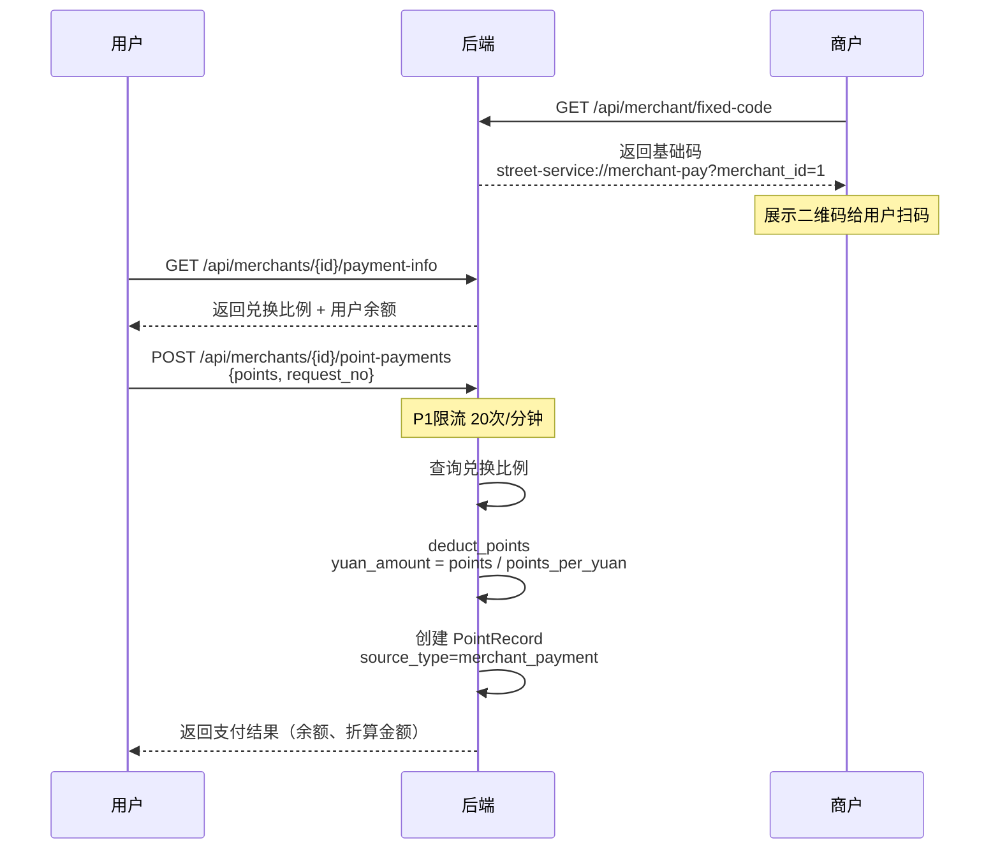
```mermaid
sequenceDiagram
    participant U as 用户
    participant API as 后端
    participant M as 商户

    M->>API: GET /api/merchant/fixed-code
    API-->>M: 返回基础码<br/>street-service://merchant-pay?merchant_id=1
    Note over M: 展示二维码给用户扫码

    U->>API: GET /api/merchants/{id}/payment-info
    API-->>U: 返回兑换比例 + 用户余额

    U->>API: POST /api/merchants/{id}/point-payments<br/>{points, request_no}
    Note over API: P1限流 20次/分钟
    API->>API: 查询兑换比例
    API->>API: deduct_points<br/>yuan_amount = points / points_per_yuan
    API->>API: 创建 PointRecord<br/>source_type=merchant_payment
    API-->>U: 返回支付结果（余额、折算金额）
```

### 10.2 固定积分码支付

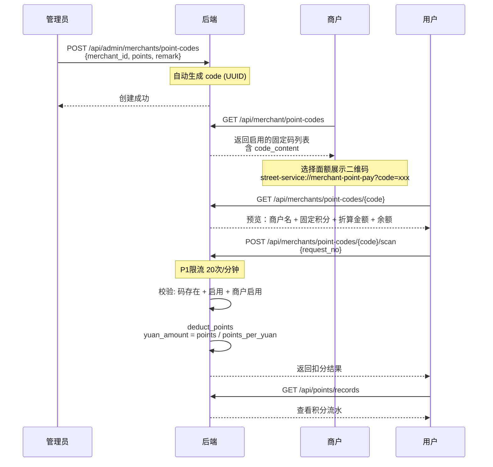
```mermaid
sequenceDiagram
    participant Admin as 管理员
    participant API as 后端
    participant M as 商户
    participant U as 用户

    Admin->>API: POST /api/admin/merchants/point-codes<br/>{merchant_id, points, remark}
    Note over API: 自动生成 code (UUID)
    API-->>Admin: 创建成功

    M->>API: GET /api/merchant/point-codes
    API-->>M: 返回启用的固定码列表<br/>含 code_content
    Note over M: 选择面额展示二维码<br/>street-service://merchant-point-pay?code=xxx

    U->>API: GET /api/merchants/point-codes/{code}
    API-->>U: 预览：商户名 + 固定积分 + 折算金额 + 余额

    U->>API: POST /api/merchants/point-codes/{code}/scan<br/>{request_no}
    Note over API: P1限流 20次/分钟
    API->>API: 校验: 码存在 + 启用 + 商户启用
    API->>API: deduct_points<br/>yuan_amount = points / points_per_yuan
    API-->>U: 返回扣分结果

    U->>API: GET /api/points/records
    API-->>U: 查看积分流水
```

### 两种支付方式对比

| 维度 | 手动输入积分 | 固定积分码 |
|------|-------------|-----------|
| 二维码内容 | `merchant-pay?merchant_id=1` | `merchant-point-pay?code=<token>` |
| 用户操作 | 扫码 -> 输入积分 -> 提交 | 扫码 -> 确认 -> 自动扣固定面额 |
| 积分面额 | 用户自定义 | 后台预设固定值 |
| 商户获取方式 | `GET /api/merchant/fixed-code` | `GET /api/merchant/point-codes` |
| 幂等支持 | request_no | request_no（不传时可重复使用） |

## 11. 商户结算流程

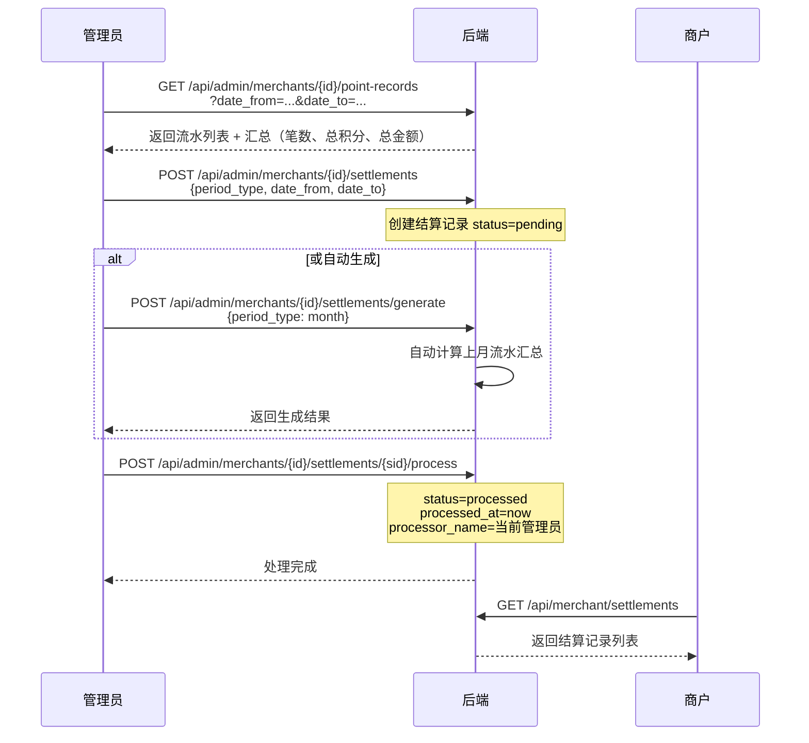
```mermaid
sequenceDiagram
    participant Admin as 管理员
    participant API as 后端
    participant M as 商户

    Admin->>API: GET /api/admin/merchants/{id}/point-records<br/>?date_from=...&date_to=...
    API-->>Admin: 返回流水列表 + 汇总（笔数、总积分、总金额）

    Admin->>API: POST /api/admin/merchants/{id}/settlements<br/>{period_type, date_from, date_to}
    Note over API: 创建结算记录 status=pending

    alt 或自动生成
        Admin->>API: POST /api/admin/merchants/{id}/settlements/generate<br/>{period_type: month}
        API->>API: 自动计算上月流水汇总
        API-->>Admin: 返回生成结果
    end

    Admin->>API: POST /api/admin/merchants/{id}/settlements/{sid}/process
    Note over API: status=processed<br/>processed_at=now<br/>processor_name=当前管理员
    API-->>Admin: 处理完成

    M->>API: GET /api/merchant/settlements
    API-->>M: 返回结算记录列表
```

### 说明

- 结算周期支持自然月和自定义日期范围。
- 管理员可手动创建结算记录，或通过生成接口自动汇总指定周期的流水数据。
- 结算记录包含流水数、总积分、总金额等汇总信息。
- 处理结算时记录处理人和处理时间。

## 12. 后台管理流程

### 12.1 管理员登录

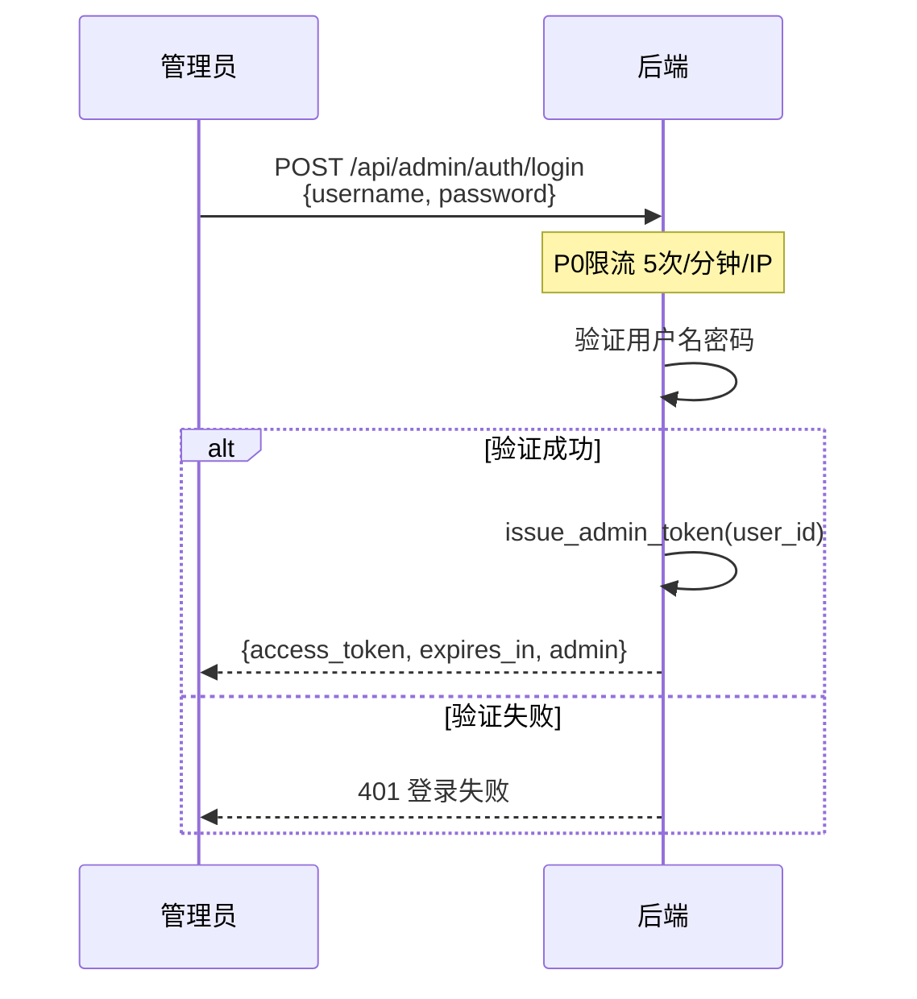
```mermaid
sequenceDiagram
    participant A as 管理员
    participant API as 后端

    A->>API: POST /api/admin/auth/login<br/>{username, password}
    Note over API: P0限流 5次/分钟/IP
    API->>API: 验证用户名密码
    alt 验证成功
        API->>API: issue_admin_token(user_id)
        API-->>A: {access_token, expires_in, admin}
    else 验证失败
        API-->>A: 401 登录失败
    end
```

### 12.2 审核工作台

管理员登录后可通过仪表盘查看各审核队列的待处理数量：

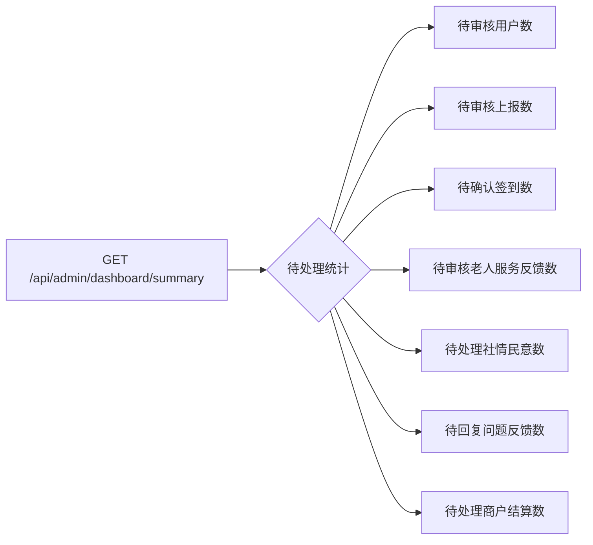
```mermaid
flowchart LR
    A[GET /api/admin/dashboard/summary] --> B{待处理统计}
    B --> C1[待审核用户数]
    B --> C2[待审核上报数]
    B --> C3[待确认签到数]
    B --> C4[待审核老人服务反馈数]
    B --> C5[待处理社情民意数]
    B --> C6[待回复问题反馈数]
    B --> C7[待处理商户结算数]
```

### 12.3 双通道管理

所有审核操作均可通过两种入口完成，最终调用同一个 Service 函数：

| 操作 | 后台管理 API | Django Admin |
|------|-------------|--------------|
| 上报审核 | `PATCH /api/admin/reports/{id}` | ReportAdmin.save_model |
| 社情民意审核 | `POST /api/admin/civic-feedbacks/{id}/review` | CivicFeedbackAdmin.save_model |
| 活动签到审核 | `POST /api/admin/activities/checkins/{id}/review` | ActivityCheckinAdmin.save_model |
| 老人服务审核 | `POST /api/admin/elder-services/feedbacks/{id}/review` | ElderServiceFeedbackAdmin.save_model |
| 用户审核 | `POST /api/admin/members/{id}/audit` | MemberAdmin |
| 问题回复 | `PATCH /api/admin/problem-feedbacks/{id}` | ProblemFeedbackAdmin.save_model |
| 商户结算 | `POST /api/admin/merchants/{id}/settlements/{sid}/process` | MerchantSettlementAdmin |

## 13. 通用图片上传流程

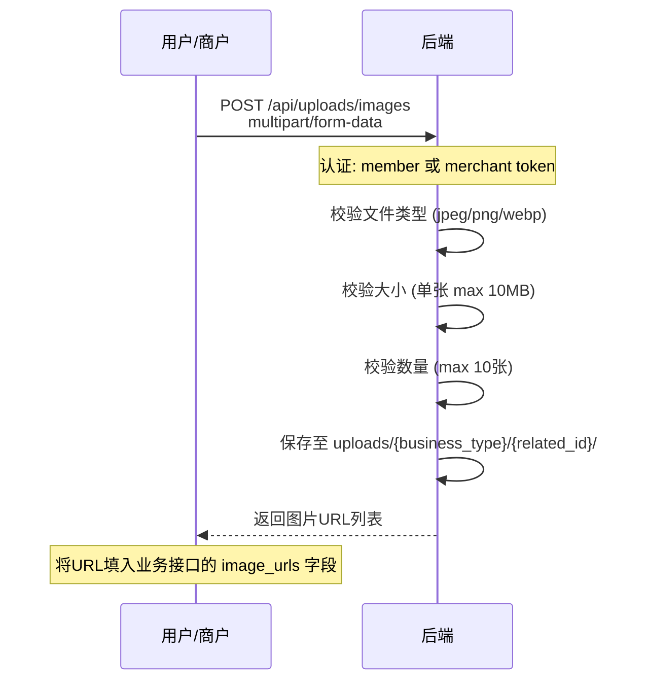
```mermaid
sequenceDiagram
    participant U as 用户/商户
    participant API as 后端

    U->>API: POST /api/uploads/images<br/>multipart/form-data
    Note over API: 认证: member 或 merchant token
    API->>API: 校验文件类型 (jpeg/png/webp)
    API->>API: 校验大小 (单张 max 10MB)
    API->>API: 校验数量 (max 10张)
    API->>API: 保存至 uploads/{business_type}/{related_id}/
    API-->>U: 返回图片URL列表
    Note over U: 将URL填入业务接口的 image_urls 字段
```

### 说明

- 通用上传接口供用户端和商户端使用（member 或 merchant token 均可）。
- 后台管理有独立的上传接口（`/api/admin/uploads/images` 和 `/api/admin/uploads/videos`），使用管理员认证。
- TinyMCE 编辑器有专门的上传端点（`/admin/tinymce/upload/image/` 和 `/admin/tinymce/upload/video/`），使用 Django Admin session 认证。
